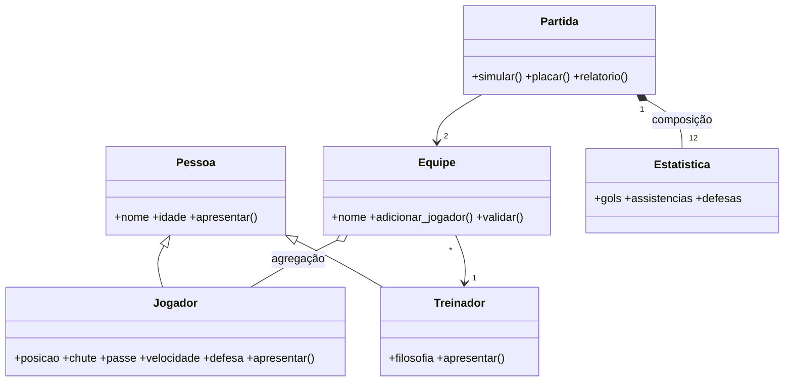
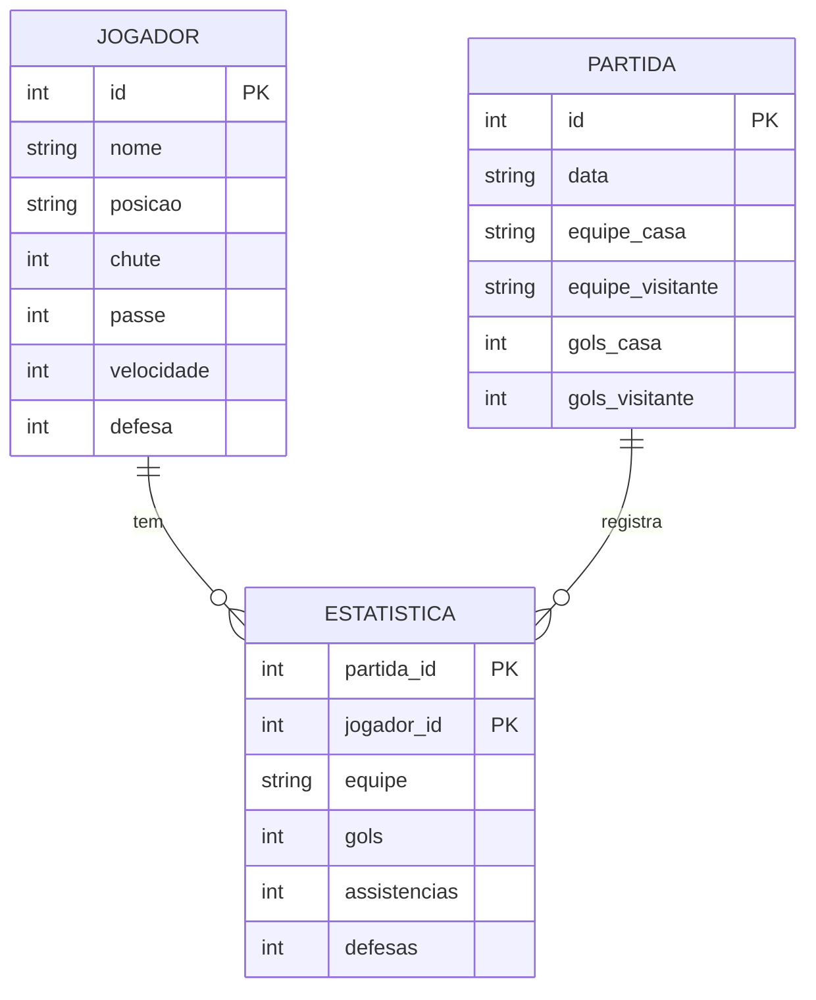

# Diagramas – Simulador 6x6

Cole cada bloco em https://mermaid.live.

```mermaid
classDiagram
    class Pessoa { +nome +idade +apresentar() }
    class Jogador { +posicao +chute +passe +velocidade +defesa +apresentar() }
    class Treinador { +filosofia +apresentar() }
    class Equipe { +nome +adicionar_jogador() +validar() }
    class Partida { +simular() +placar() +relatorio() }
    class Estatistica { +gols +assistencias +defesas }
    Pessoa <|-- Jogador
    Pessoa <|-- Treinador
    Equipe "1" o-- "6" Jogador : agregação
    Equipe "*" --> "1" Treinador
    Partida "*" --> "2" Equipe
    Partida "1" *-- "12" Estatistica : composição
```

```mermaid
erDiagram
    JOGADOR ||--o{ ESTATISTICA : tem
    PARTIDA ||--o{ ESTATISTICA : registra
    JOGADOR { int id PK
      string nome
      string posicao
      int chute
      int passe
      int velocidade
      int defesa }
    PARTIDA { int id PK
      string data
      string equipe_casa
      string equipe_visitante
      int gols_casa
      int gols_visitante }
    ESTATISTICA { int partida_id PK
      int jogador_id PK
      string equipe
      int gols
      int assistencias
      int defesas }
```
